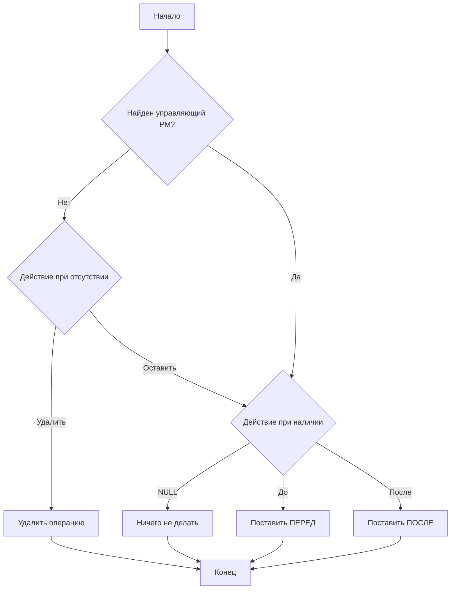
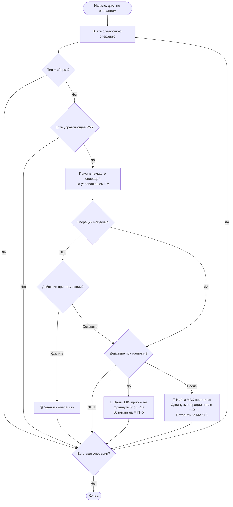
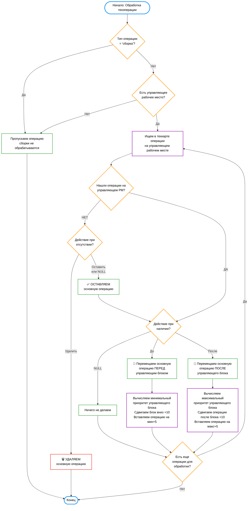

# Пошаговое построение диаграммы

## Шаг 3: Добавим детали для "наличия"

```mermaid
flowchart TD
    A[Начало] --> B{Найден управляющий РМ?}
    B -->|Нет| C{Действие при отсутствии}
    B -->|Да| D{Действие при наличии}
    
    C -->|Удалить| C1[Удалить операцию]
    C -->|Оставить| D
    
    D -->|NULL| D1[Ничего не делать]
    D -->|До| D2[Поставить ПЕРЕД]
    D -->|После| D3[Поставить ПОСЛЕ]
    
    C1 --> E[Конец]
    D1 --> E
    D2 --> E
    D3 --> E
```

## Шаг 5: С циклом и приоритетами

```mermaid
flowchart TD
    Start([Начало: цикл по операциям]) --> GetNext[Взять следующую операцию]
    GetNext --> CheckType{Тип = сборка?}
    
    CheckType -->|Да| NextOp
    CheckType -->|Нет| CheckControl{Есть управляющее РМ?}
    
    CheckControl -->|Нет| NextOp
    CheckControl -->|Да| SearchOps[Поиск в техкарте операций<br/>на управляющем РМ]
    
    SearchOps --> Found{Операции найдены?}
    
    Found -->|НЕТ| CheckAbsence{Действие при отсутствии?}
    CheckAbsence -->|Удалить| DeleteOp[🗑️ Удалить операцию]
    CheckAbsence -->|Оставить| CheckExist{Действие при наличии?}
    
    Found -->|ДА| CheckExist
    
    CheckExist -->|NULL| NextOp
    CheckExist -->|До| MoveBefore[📍 Найти MIN приоритет<br/>Сдвинуть блок +10<br/>Вставить на MIN+5]
    CheckExist -->|После| MoveAfter[📍 Найти MAX приоритет<br/>Сдвинуть операции после +10<br/>Вставить на MAX+5]
    
    DeleteOp --> NextOp
    MoveBefore --> NextOp
    MoveAfter --> NextOp
    
    NextOp{Есть еще операции?}
    NextOp -->|Да| GetNext
    NextOp -->|Нет| End([Конец])
```

## Исправленная версия:

```mermaid
flowchart TD
    Start(["Начало: Обработка техоперации"]) --> CheckType{"Тип операции<br>= 'сборка'?"}
    
    CheckType -->|Да| Skip["Пропускаем операцию<br>сборки не обрабатываются"]
    CheckType -->|Нет| CheckControl{"Есть управляющее<br>рабочее место?"}
    
    CheckControl -->|Нет| Skip
    CheckControl -->|Да| SearchOps["Ищем в техкарте операции<br>на управляющем рабочем месте"]
    
    SearchOps --> Found{"Нашли операции на<br>управляющем РМ?"}
    
    Found -->|НЕТ| CheckAbsence{"Действие при<br>отсутствии?"}
    CheckAbsence -->|Удалить| DeleteOp["🗑️ УДАЛЯЕМ<br>основную операцию"]
    CheckAbsence -->|Оставить<br>или NULL| KeepOp["✅ ОСТАВЛЯЕМ<br>основную операцию"]
    
    DeleteOp --> End(["Конец"])
    KeepOp --> CheckExist{"Действие при<br>наличии?"}
    
    Found -->|ДА| CheckExist
    
    CheckExist -->|NULL| DoNothing["Ничего не делаем"]
    CheckExist -->|До| MoveBefore["📍 Перемещаем основную<br>операцию ПЕРЕД<br>управляющим блоком"]
    CheckExist -->|После| MoveAfter["📍 Перемещаем основную<br>операцию ПОСЛЕ<br>управляющего блока"]
    
    DoNothing --> NextOp{"Есть еще<br>операции для<br>обработки?"}
    
    MoveBefore --> CalcPriorityBefore["Вычисляем минимальный<br>приоритет управляющего блока<br>Сдвигаем блок вниз +10<br>Вставляем операцию на мин+5"]
    MoveAfter --> CalcPriorityAfter["Вычисляем максимальный<br>приоритет управляющего блока<br>Сдвигаем операции после блока +10<br>Вставляем операцию на макс+5"]
    
    CalcPriorityBefore --> NextOp
    CalcPriorityAfter --> NextOp
    
    NextOp -->|Да| SearchOps
    NextOp -->|Нет| End
    Skip --> End
    
    %% Стили для узлов
    classDef startEnd fill:#ffffff,stroke:#2196f3,stroke-width:3px,color:#000000
    classDef decision fill:#ffffff,stroke:#ff9800,stroke-width:2px,color:#000000
    classDef process fill:#ffffff,stroke:#9c27b0,stroke-width:2px,color:#000000
    classDef action fill:#ffffff,stroke:#4caf50,stroke-width:2px,color:#000000
    classDef delete fill:#ffffff,stroke:#f44336,stroke-width:2px,color:#000000
    
    %% Применение стилей
    class Start,End startEnd
    class CheckType,CheckControl,Found,CheckAbsence,CheckExist,NextOp decision
    class SearchOps,CalcPriorityBefore,CalcPriorityAfter process
    class DoNothing,KeepOp,MoveBefore,MoveAfter action
    class DeleteOp delete
    class Skip action
```
